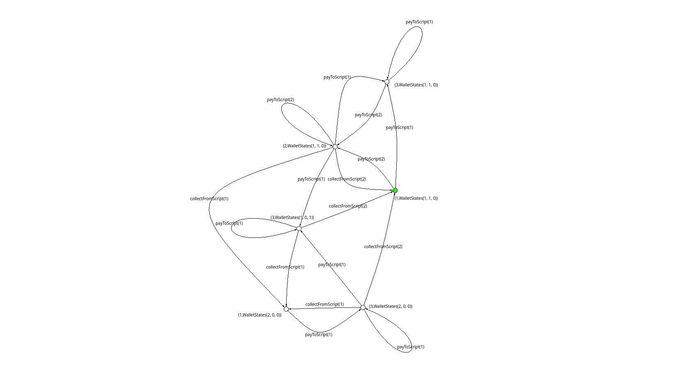

Plutus Smart Contract Formal Spec
=======================================

This is an extremely early attempt at trying to model Plutus Smart Contracts in mCRL2, a process algebra/formal specification language. 

Doing so would provide the ability to use model checking to go through a smart contract's statespace and verify whichever invariants/properties one pleases and/or find counter-examples which prove that one's model is broken. 

This may turn out to be one of the more practical approaches for using formal methods in Smart Contract design, but only time will tell.

Below is a graphed Labled Transition System of the spec thus far (with each wallet starting with 1 ada to make it not cluttered):

